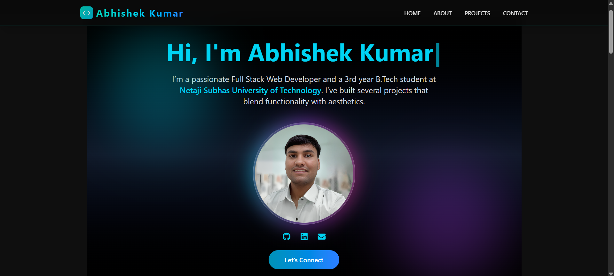
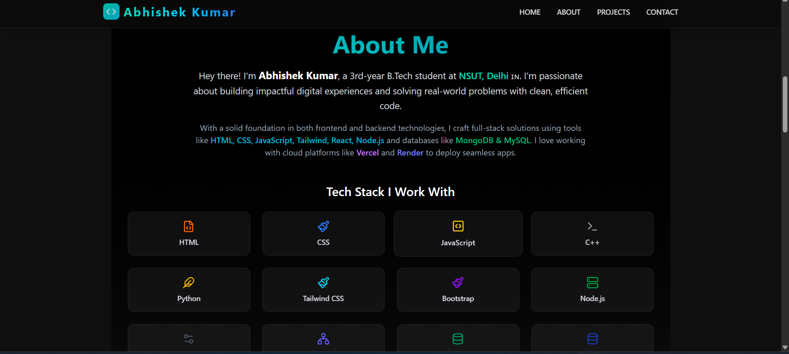
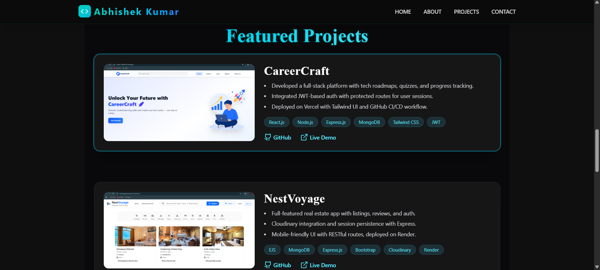
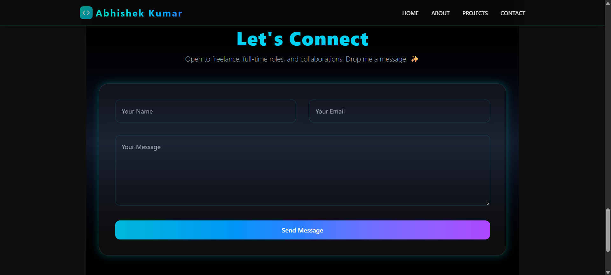

# Abhishek Kumar | Developer Portfolio

Welcome to my personal developer portfolio built using **React + Vite** and deployed with **Netlify**. This site showcases my projects, skills, and a dynamic contact form powered by **EmailJS**.

## 🔗 Live Website

🌐 [Visit Portfolio](https://portfolio8983.netlify.app/)  


---

## 🛠️ Tech Stack

- ⚛️ React (Vite)
- 💨 Tailwind CSS
- 📩 EmailJS (for contact form)
- 🌐 Netlify (hosting)
- 🎨 Custom Favicon (neon, cyan-themed `</>` icon)

---

## 📁 Folder Structure
```bash
my-portfolio/
├── public/
│ ├── favicon.png
│ └── vite.svg
├── src/
│ ├── components/
│ ├── pages/
│ └── main.jsx
├── index.html
└── README.md
```


---

## ✨ Features

- 💼 Project Showcase Cards
- 📱 Responsive Design
- 📬 Contact Form with EmailJS
- 🌓 Light/Dark Mode Toggle
- 🖼️ Custom Neon-themed Favicon
- 🔍 Smooth section navigation

---

## 📬 Contact Form

Powered by **EmailJS**, the form sends messages directly to your inbox.

### 🔒 Important:
To avoid emails going to **spam**, ensure:
- You verify your EmailJS sender email.
- Use proper subject lines and include a recognizable sender name.
- Consider upgrading EmailJS for verified domains if used professionally.

---

## 🚀 Getting Started

1. Clone the repository:

```bash
git clone https://github.com/yourusername/portfolio.git
cd portfolio
```

2. Install dependencies:

```bash
npm install
```

3. Start development server:

bash
```
npm run dev
```

4. Build for production:

bash
```
npm run build
```

## 📸 Preview










## 💬 Contact the Developer
📧 Email: abhikumar898307@gmail.com

🔗 LinkedIn: https://www.linkedin.com/in/abhishekkumar8983/

🐙 GitHub: https://github.com/abhishek5703

Feel free to connect, collaborate, or drop any feedback!


